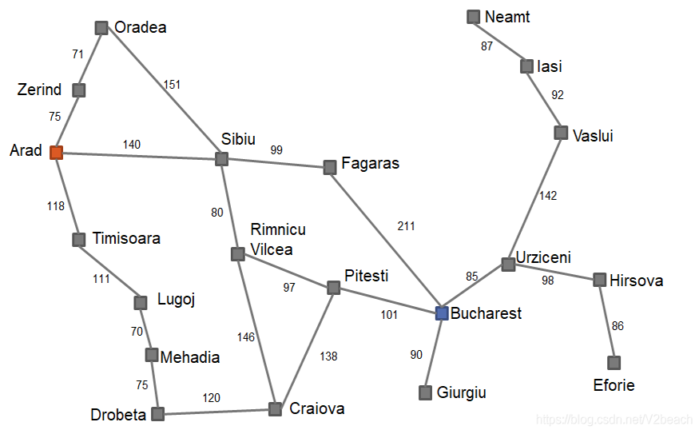
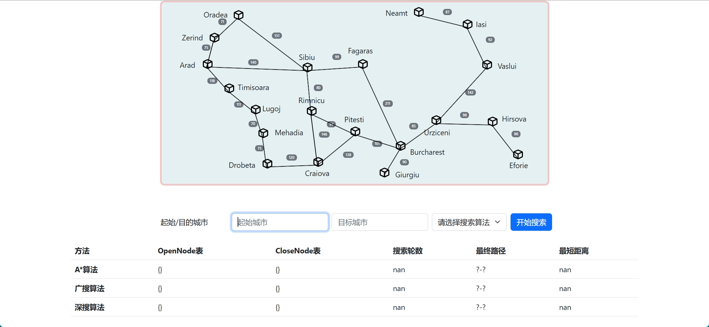

# Romania Cities Pathfinding
The presentation of this project is in my [my Bilibili video](https://www.bilibili.com/video/BV1iG411u7mH/?spm_id_from=333.999.0.0).

A simple pathfinding visualization for Romanian cities using different search algorithms.

## Cities
he program includes 20 Romanian cities, with the coordinates in the following:
```
Arad=(91, 492), Bucharest=(400, 327), Craiova=(253, 288),
Drobeta=(165, 299), Eforie=(562, 293), Fagaras=(305, 449),
Giurgiu=(375, 270), Hirsova=(534, 350), Iasi=(473, 506),
Lugoj=(165, 379), Mehadia=(168, 339), Neamt=(406, 537),
Oradea=(131, 571), Pitesti=(320, 368), Rimnicu=(233, 410),
Sibiu=(207, 457), Timisoara=(94, 410), Urziceni=(456, 350),
Vaslui=(509, 444), Zerind=(108, 531)
```

## Install requirements:
```
pip install -r requirements.txt
```

## Run the program:
```
cd src
python app.py
```

## Play with the program:
Open the browser and go to http://127.0.0.1:5000/. You will see the following page:


Currently, you can enter the first initial of the city name with uppercase to search for the city. For example, enter "A" to search for Arad for the start city and "B" to search for Bucharest for the destination city. Then select the search algorithm (including breadth-first search, depth-first search, A* search). Then click the "Search" button to start the search with visualizing the path.
